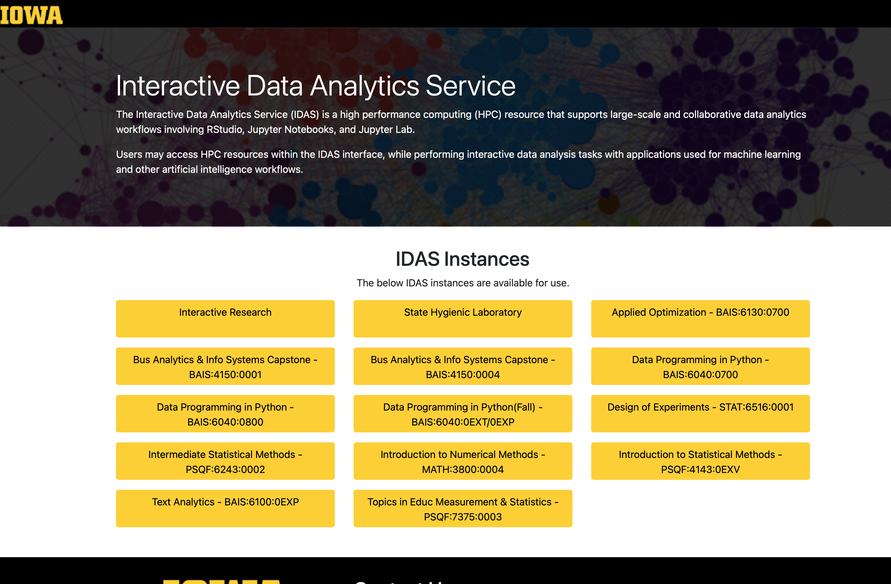
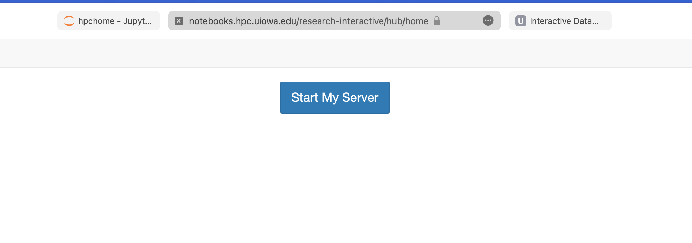
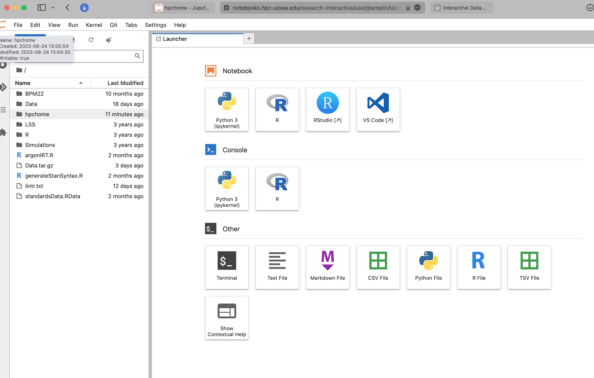
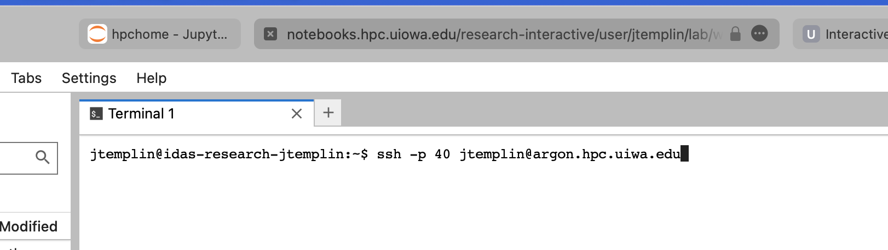

# Introduction To Argon and High Performance Computing

This document provides basic instructions for accessing and using the Argon cluster at the University of Iowa. Argon is a high performance computing cluster that is available to all UI students, faculty, and staff. Argon is a shared resource, so it is important to be considerate of other users. This document will cover the following topics:

* Accessing Argon
* Using Argon
* Running Jobs on Argon


## Accessing Argon

### SSH Access
To access Argon, you will need to use an SSH client. If you are using a Mac or Linux computer, you can use the built-in Terminal application. If you are using a Windows computer, you will need to download an SSH client such as [PuTTY](https://www.putty.org/). Once you have an SSH client installed, you can connect to Argon by typing the following command into your terminal:

```ssh -p 40 <your_hawkid>@argon.hpc.uiowa.edu```

The ssh access will only provide a terminal window (a basic prompt). Another useful way to access Argon is through the Interactive Data Analytics Service (IDAS) "Interactive Research" server.


### IDAS Instance Access

To use an IDAS instance, go to [https://notebooks.hpc.uiowa.edu](https://notebooks.hpc.uiowa.edu) and select "Interactive Research"



From here, click on the "Start My Server" button":



Then, use the following options to configure your server instance:

* CPU Cores: 8
* Memory Limit (GiB): 16
* GPU: None
* Mount HPC Home: Yes
* LSS Shared: Leave blank
* LSS Dedicated: Leave blank
* IDAS Image: IDAS-R-4.3.1


Press "Start to launch the instance

#### Accessing the Instance

The IDAS Instance has many useful applications and, more importantly provides a visual link to the Argon file system. Argon files are located in the folder named "hpchome".



Additionally, you can use the terminal window to connect to Argon via ssh:



## Using Argon

### Basic Bash Commands

The Argon cluster uses the Linux operating system. The Linux operating system uses a command line interface (CLI) to interact with the computer. The CLI is a text-based interface that allows you to interact with the computer by typing commands. The CLI is accessed through the terminal application. The terminal application is a program that allows you to type commands into the computer. The terminal application is also called a shell. The shell is the program that interprets the commands that you type into the terminal. The shell that is used on Argon is called bash. Bash is a very common shell that is used on many Linux systems. The following sections will cover some basic bash commands that will be useful when using Argon.

#### Navigating the File System

The file system is the structure that is used to organize files on a computer. The file system is organized in a hierarchical structure. The top level of the file system is called the root directory. The root directory is represented by a forward slash (/). The root directory contains many subdirectories. Each subdirectory can contain more subdirectories. 

The following command will print the current working directory:

```pwd```

The following command will list the contents of the current working directory:

```ls```

The following command will change the current working directory to the home directory:

```cd ~```

The following command will change the current working directory to the parent directory:

```cd ..```

The following command will change the current working directory to the specified directory:

```cd <directory>```

The following command will create a new directory:

```mkdir <directory>```

The following command will remove a directory:

```rmdir <directory>```

The following command will remove a directory and all of its contents:

```rm -rf <directory>```

#### File Manipulation

The following command will create a new file:

```touch <file>```

The following command will copy a file:

```cp <source_file> <destination_file>```

The following command will move a file:

```mv <source_file> <destination_file>```

The following command will remove a file:

```rm <file>```

#### File Permissions

The following command will print the permissions of a file:

```ls -l <file>```

The following command will change the permissions of a file:

```chmod <permissions> <file>```

#### File Transfer

The following command will transfer a file from your local computer to Argon:

```scp <local_file> <hawkid>@argon.hpc.uiowa.edu:<destination_file>```

The following command will transfer a file from Argon to your local computer:

```scp <hawkid>@argon.hpc.uiowa.edu:<source_file> <local_file>```

### Text Editors

A text editor is a program that is used to create and edit text files. There are many different text editors that are available on Argon. The following sections will cover some of the most common text editors that are available on Argon.

#### Nano

Nano is a very simple text editor that is available on Argon. Nano is a good text editor for beginners because it is very easy to use. To open a file in nano, use the following command:

```nano <file>```

To save a file in nano, use the following command:

```Ctrl + O```

To exit nano, use the following command:

```Ctrl + X```


### Modules

Modules are used to manage the software environment on Argon. Modules allow you to load and unload software packages. The following sections will cover some basic module commands that will be useful when using Argon.

#### Loading Modules

The following command will list all of the available modules:

```module avail```

The following command will load a module:

```module load <module>```

The following command will unload a module:

```module unload <module>```

The following command will list all of the loaded modules:

```module list```

#### Common Modules

The following modules are commonly used on Argon:

module load stack/2022.2
module load stack/2022.2-base_arch
module load r/4.2.2_gcc-9.5.0

## Running Jobs on Argon

Please refer to (https://jonathantemplin.com/introduction-to-the-university-of-iowa-high-performance-computing-system-argon-and-iowa-interactive-data-analytics-service-idas/)[https://jonathantemplin.com/introduction-to-the-university-of-iowa-high-performance-computing-system-argon-and-iowa-interactive-data-analytics-service-idas/] for how to run jobs on Argon.

## Running Jobs with Apptainer

Argon allows the use of Apptainer images (prebuilt stacks of software) that simplify the process of using software on the system. The following sections will cover how to use Apptainer images on Argon.

For our class, we will use an Apptainer image that I created that contains (what I believe to be) all necessary software. 

To copy the image, use the following command:

```cp /Shared/lss_jtemplin/argonstack.sif ~/.```

To run the image, use the following command:

```apptainer run ~/argonstack.sif [your command to run]```

Additionally, be sure to activate the stack/2022.2 module by listing it first on your job script to avoid any error messages.